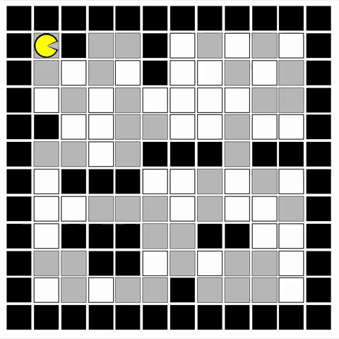
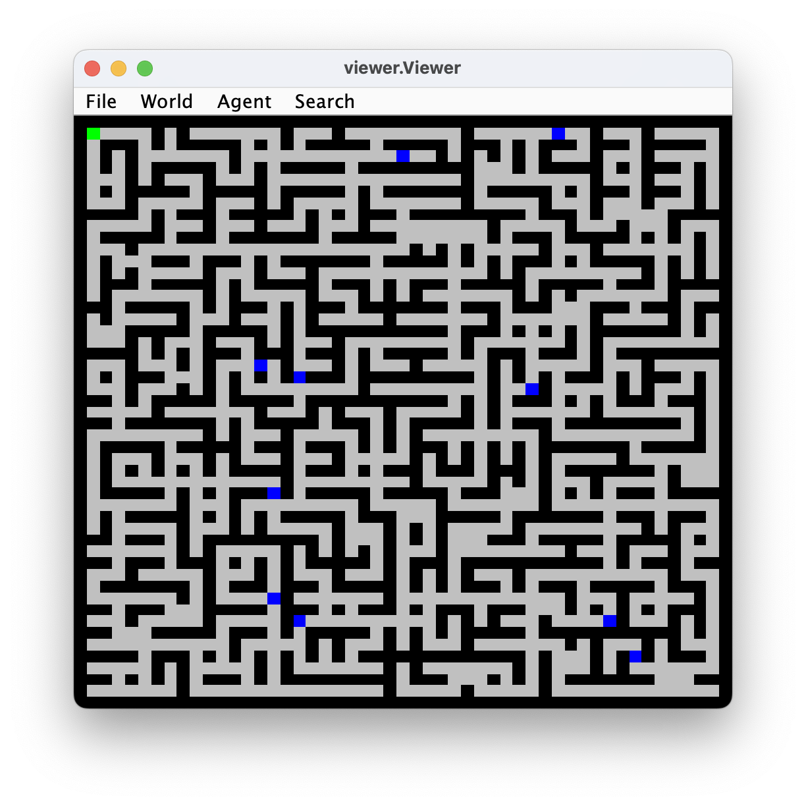
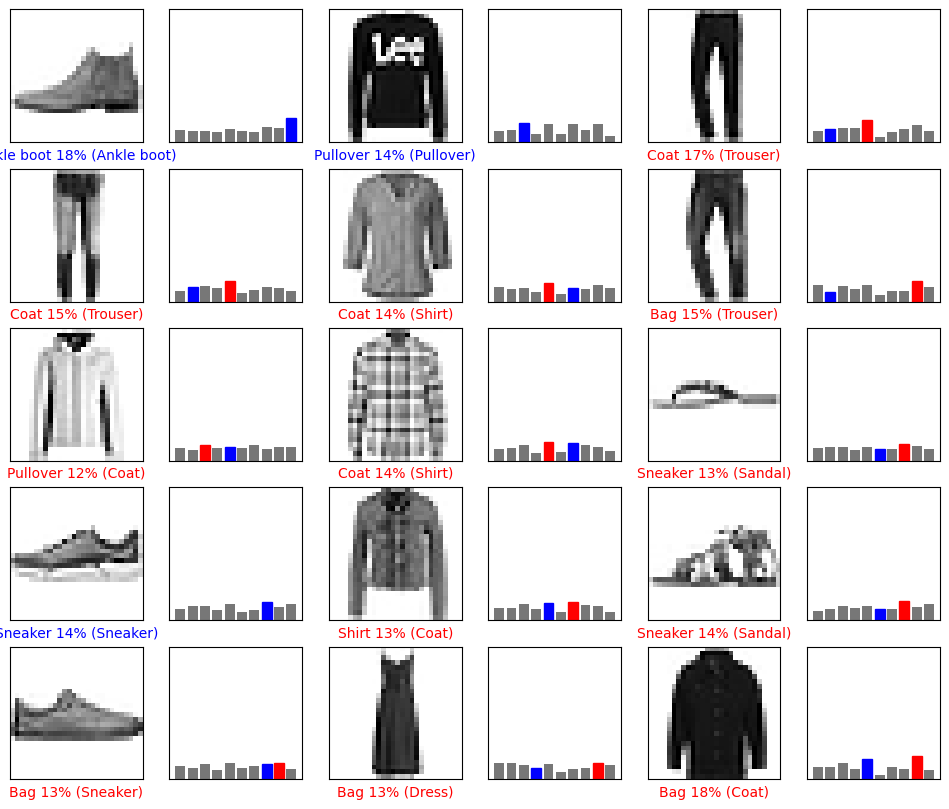
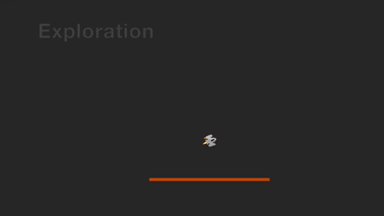

# TDDC17

Lab exercises in the course TDDC17, Artificial Intelligence, at Linköping University. https://www.ida.liu.se/~TDDC17/info/labs.en.shtml

## Lab 1

We have created a search algorithm for a vacuum cleaner robot that explores an unknown grid using breadth-first search (BFS).

## Lab 2

We implemented a general graph search algorithm, differentiating between BFS and DFS based on node placement in a queue.

## Lab 3

We computed the gradient of a loss function using Tensorflow, calculated parameters in a dense layer, and assessed the impact of batch sizes on training performance.

## Lab 4

We used Bayesian Networks to analyze melt-down risks in a power plant, evaluated survival probabilities under different conditions, and discussed modeling dynamic weather patterns.

## Lab 5

We did reinforcement learning to train a rocket to hover by discretizing its angle and velocity and using Q-learning updates based on specified rewards, and observed that without exploration the agent only performs its initial random action.

## Lab 6

We modeled a planning task for our household robot to unlock doors using the Unified Planning Library and then applied greedy best-first search and A\* search techniques to determine optimal plans and their associated costs.
